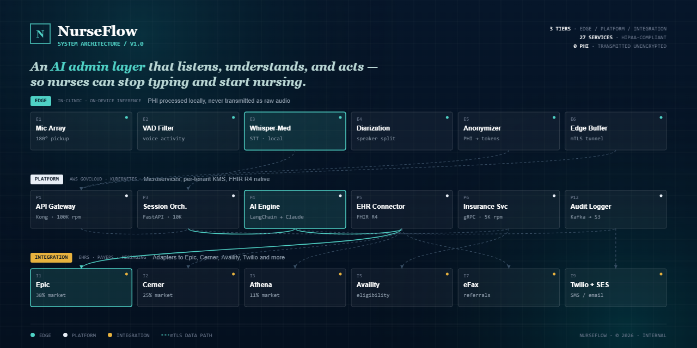

# NurseFlow

> An AI-powered clinical workflow assistant that listens, understands, and acts — so nurses can stop typing and start nursing.

---

## What is NurseFlow?

NurseFlow is an AI admin layer built for clinical environments. It sits between the nurse and the EHR — listening to patient interactions in real time, generating structured SOAP notes automatically, and routing documentation tasks without manual entry.

**The problem it solves:** Nurses spend up to 70% of their shift on paperwork. NurseFlow cuts that down by handling transcription, note generation, and workflow management autonomously.

**Key capabilities (MVP):**
- Real-time audio transcription using Whisper
- Automatic SOAP note generation via Claude AI
- Nurse review dashboard for approval and edits
- Session-based architecture for multi-patient workflows
- Future-ready EHR integration layer
